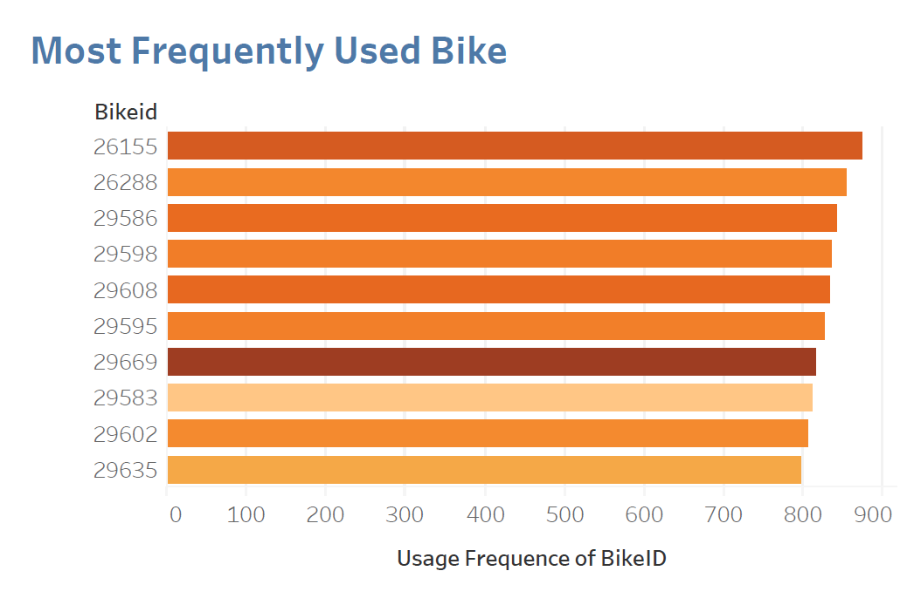
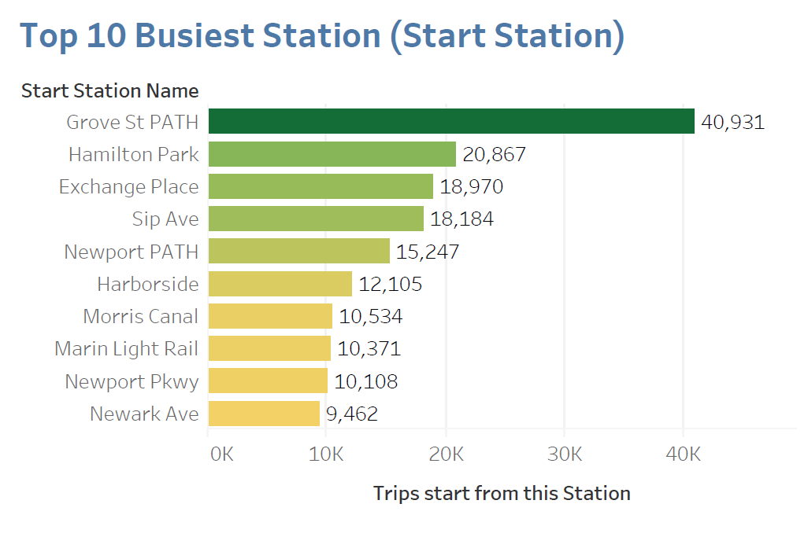
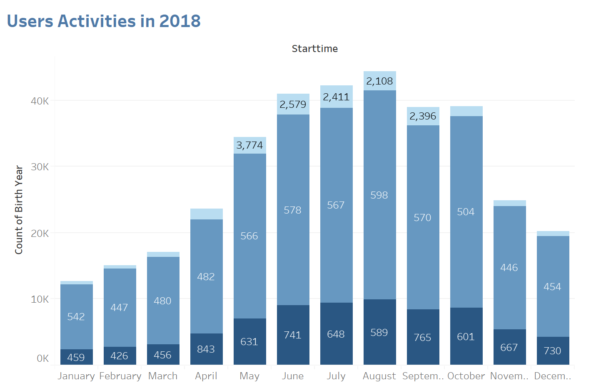
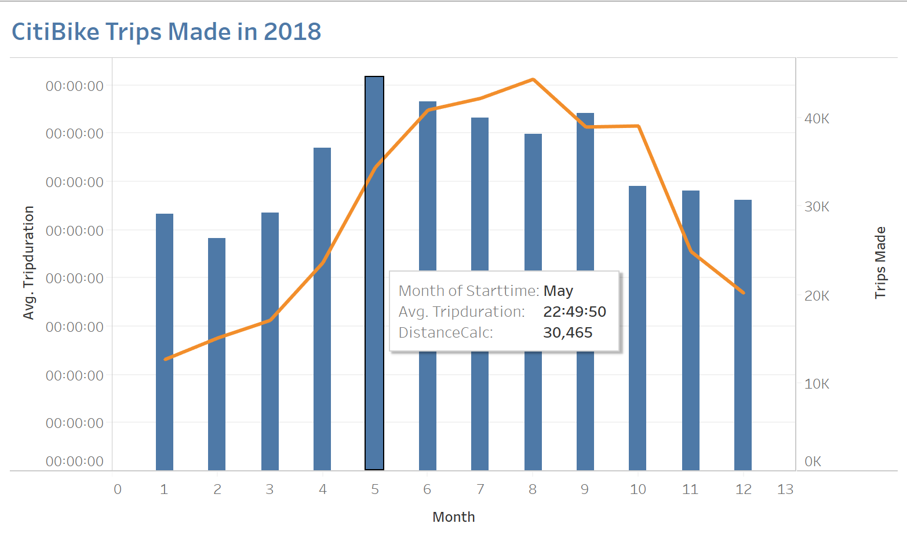
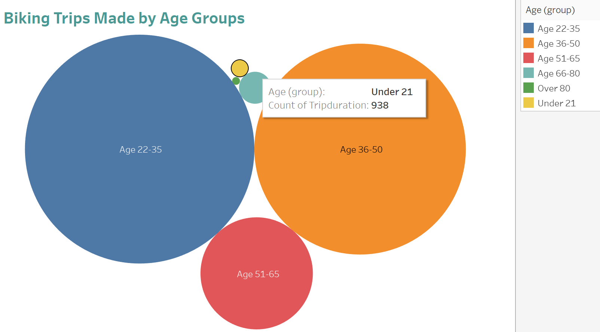
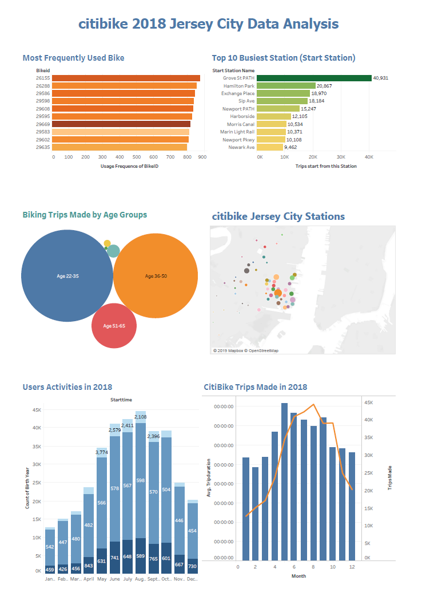

# Tableau Project - Citi Bike Analytics


## Project Background

Since 2013, the Citi Bike Program has implemented a robust infrastructure for collecting data on the program's utilization. Through the team's efforts, each month bike data is collected, organized, and made public on the [Citi Bike Data](https://www.citibikenyc.com/system-data) webpage. We are using Tableau to implement a dashboard for reporting purpose.


## Raw Data ETL

Download all the datasheets/datasets from above website for Year 2018 CitiBike data collected in Jersey city;
Use Python to combine all the months' data into a single dataset.

```python
import pandas as pd
import os
import dask.dataframe as dd

df = dd.read_csv('data/*tripdata.csv', dtype={'end station id': 'float64',
       'start station id': 'float64'})
df.info()
df = df.compute()

df.to_csv("data/Combined_JC2018.csv")
df = pd.read_csv("data/Combined_JC2018.csv", encoding="utf-8")

```


## Data Analysis & Visulization


* List the Top 10 BikeIDs in the area; 
Indicating which bike(s) are the most frequently used and, it might take the deepest depreciation throught the year



---

* List the Top 10 Bike Station in Jersey City;
Identifying the busiest stations in order to decide how many bikes we need to keep for each.



---

* CitiBike Users Demographics through Year 2018; Categorized by gender



---

* Illustration of Riding data in 2018 by Months; focusing on Average Trip counts, Trip Distances and Trip Duration/time.



---

* Citi Bike Users Analysis; Categorized by Age




## Aggregate all the charts into a Dashboard

Print and save as PDF.



